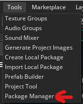
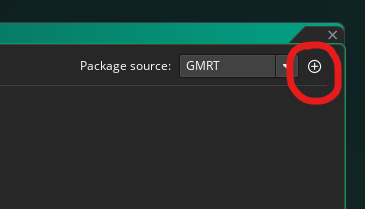
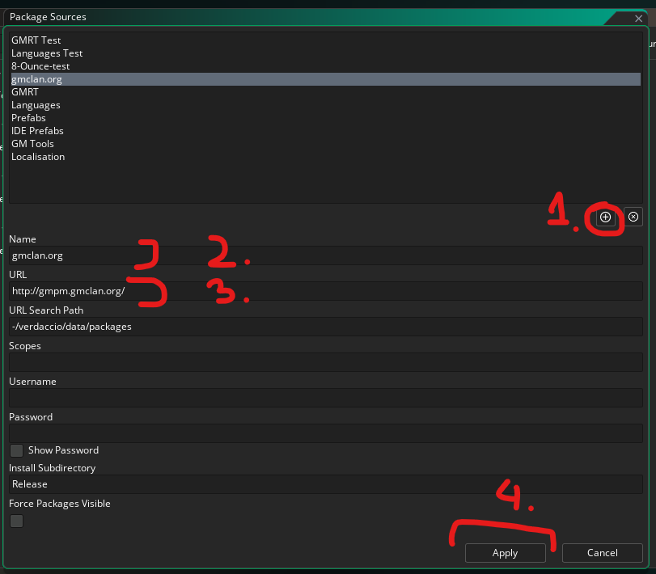
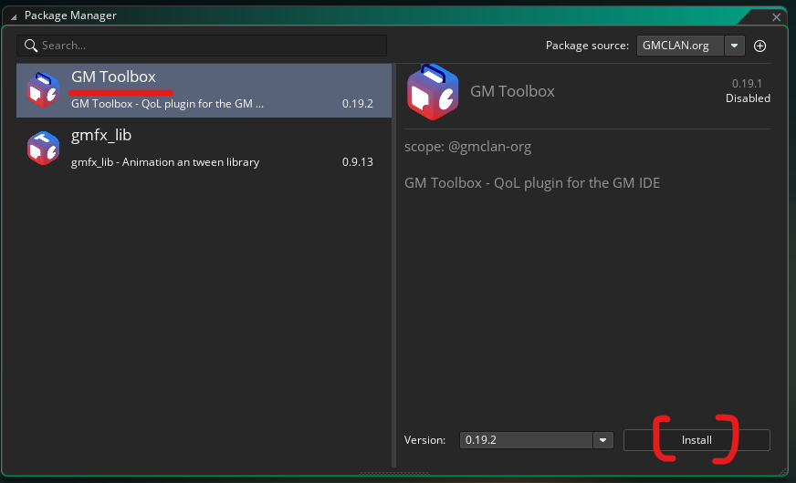

# GM Toolbox — QoL plugin for the GameMaker IDE

> [!TIP]
> If you like this plugin, please consider donating us - money goes into contribution to non-comercial website gmclan.org .
>
> [](https://ko-fi.com/gnysek)
> [](https://buycoffee.to/gnysek)

A quality-of-life plugin for the GameMaker LTS 2026 IDE — developer tools
for checking object usage in a project, plus a handful of small editor UI
improvements.

Made by @gnysek from [gmclan.org](https://gmclan.org).

> [!CAUTION]
> **Not affiliated with, endorsed by, or maintained by YoYo Games.** This
> is a third-party, unofficial plugin built against internal, undocumented
> IDE assemblies — it can break with any future GameMaker release, and
> YoYo Games has stated they will not make any accommodations for plugins
> in their release schedule. **Please report bugs and issues about this
> plugin [here](#bug-reports), never to YYG.**

> [!WARNING]
> **Do not report bugs about this plugin to YoYo Games.** See "Bug reports" and "Disclaimer" setctions on bottom of page.

> [!IMPORTANT]
>Transparency notice: this plugin was made with help of AI, but QA is always made by human.

## Contents

  * [What does it add?](#what-does-it-add)
  * [Requirements](#requirements)
  * [Download](#download)
  * [**Installation**](#installation)
  * [**Uninstalling**](#uninstalling)
  * [Legacy uninstall](#legacy-uninstall)
  * [Features in detail](#features-in-detail)
  * [Known limitations](#known-limitations)
  * [Bug Reports](#bug-reports)
  * [Disclaimer](#disclaimer)
  * [License](#license)

## What does it add?

*(see [FEATURES.md](FEATURES.md) for screenshots and full descriptions)*

**General addons** (from `Plugins` menu in top bar)

- **Check Asset Usage** *(`Plugins` menu)* — a unified usage-checker window
  covering Objects, Sprites, and Rooms: finds where a given asset is used
  (objects, rooms, parents, code, room-object variable definitions), or
  finds orphaned Objects/Sprites nothing references. Scope checkboxes let
  you skip the GML-code scan or the other `.yy`-file scan, and filter out
  matches inside comments.
- **GM QoL Toolbox Options** *(`File > Preferences`, or `Plugins` menu)*
  — a real preferences page to turn every feature below on or off
  individually, plus a couple of settings like how many recent resources
  to remember. Stored in its own file, never in GameMaker's own
  preferences.
- **Advanced Search** *(`Plugins` menu)* — a project-wide text/*regex** search
  that can exclude whole categories (Objects, Scripts, Sequences, Rooms,
  Notes, Timelines, Shaders) or a specific Asset Browser group by name
  (e.g. skip a vendored "Extensions"/"GMLive" folder), or restrict results
  to resources carrying one of a set of project tags — something the
  native Search & Replace can't do.
- **Search Variable Overrides** *(`Plugins` menu)* — pick an object, choose
  which of its Variable Definitions (own or inherited from a parent) to
  search for, and find every room instance that overrides one of them via
  its per-instance properties. Can also extend the search to every
  child/subclass object.
- **Toolbar buttons** *(IDE main toolbar)* — quick-access buttons for
  `Search and Replace` and `Advanced Search`, next to the native
  collapse/expand-docks button.
- **Re-run button** *(IDE main toolbar)* — a `Re-run` button between the
  native `Run` and `Stop` buttons, doing the same thing as `Build > Re-run`.
  Greyed out when re-running isn't currently available.

**Object Editor**

- **Usage button** *(Object Editor)* — opens the Check Asset Usage window
  pre-filled for the object you're currently editing, without leaving its
  edit window.
- **Green section icons** *(Object Editor)* — the Parent and Variable
  Definitions icons light up when that section actually has content.
- **Opening the collision object from the Events window** *(Object
  Editor → Events window, right-click or middle-click a Collision
  event)* — opens the editor for the object it collides with.
- **`Collision (Select)...`** *(Object Editor → Add/Change Event)* — the
  same searchable object picker as when searching for parent/child objects, and similar to when selecting sprites for object.
- **Force minimal width for Events window** *(Preferences, off by
  default)* — the Events window normally can't be resized wider until
  the Variable Definitions window is also open; when enabled, sets its
  width to a configurable value (in DPI pixels) as soon as it opens.

**Sprite Editor**

- **Usage button** *(Sprite Editor)* — opens the Check Asset Usage window
  pre-filled for the sprite you're currently editing, without leaving its
  edit window (matches Object Editor's Usage button).

**Image Editor**

- **`Convert to Frames` with an Auto checkbox** *(Image Editor → strip
  import dialog)* — computes `Number of Frames` / `Frames per Row`
  automatically from the image size and `Frame Width`/`Frame Height`.

**Navigation**

- **`Find in Resource Tree`** *(right-click a resource window/tab)* —
  selects it in the Asset Tree.
- **`Rearrange Windows`** *(right-click empty workspace canvas)* — lines
  up open windows into a column when gaps appear after closing some of
  them.
- **`Close All Windows`** *(right-click empty workspace canvas)* — same
  as the native `Close All`, just higher up in the menu instead of buried
  at the bottom of a submenu with 500 entries.
- **`Shift+F4`** *(global hotkey)* — a list of the last 30 resources by
  open/close order, a quick way back to something you just closed.

**Room Editor**

- **Move Assets** *(Room Editor toolbar, or the `M` key)* — shifts the
  selected layer or all layers by a given offset.
- **Room Assets Palette** *(Room Editor toolbar)* — quickly insert
  objects into a room, filtered by layer type; selecting something in the
  Asset Tree switches priority back to the Asset Tree (you'll need to
  select in the palette again), so it never blocks the default workflow —
  both drag-and-drop and `ALT`+click insertion work; dockable. A name
  filter plus a tag filter (matching any of the checked project tags) let
  you narrow down a long list.
- **Highlighting instances with overrides** *(Room Editor toolbar, or
  hold `I`)* — a red rectangle (50% opacity) around every instance with
  overridden Variables or its own Creation Code.
- **Width/Height in pixels ("Scale in px")** *(instance/sprite-asset
  properties window, and docked Inspector)* — an editable pixel
  Width/Height next to the native Scale X/Scale Y, kept in sync with it.
  Only added if the separate SpriteUsage plugin isn't already installed —
  that one already provides this, so this plugin steps aside instead of
  duplicating it.

**Docking**

- **`F11`** *(global hotkey)* — collapses/expands only the bottom dock
  (Output, Search Results, etc.), unlike the native `F12`, which does it
  for all three docks at once.

**Font Editor**

- **`Copy Range as Text`** *(Font Editor, below `Regenerate`)* — copies
  every character across every defined range to the clipboard as one
  continuous string, ready to paste into an external tool (e.g.
  Photoshop) to design a matching pixel font.

If new preferences are added in future releases, it will show default GM notification balloon with link to Preferences window, so you can disable what you don't like. By default all features are enabled.

## Requirements

- **GameMaker LTS 2026** or **GameMaker Beta** (the plugin links against
  internal IDE assemblies specific to those release lines; it will not
  load on Monthly/Stable or other lines)
- Windows
- [GMPM](https://gmpm.gmclan.org/) (GameMaker Package Manager) — see
  [Installation](#installation) below

## Download

No manual download needed — the plugin is distributed as a package
through GMPM, see [Installation](#installation) below. If you'd rather
grab a raw build instead, the packaged `.tgz` for each release is
attached to the matching [GitHub
Release](https://github.com/gmclan-org/gm-qol-toolbox-plugin/releases/latest).

## Installation

Since version 0.19.3, the plugin can be installed using GMPM.
Steps to install:

**If you haven't added the GMCLAN GMPM source yet**

Click `Tools > Package Manager`



Click `Manage Package sources`



Click Add (1), then enter `gmclan.org` as Name (2) (you can use a
different name), then `http://gmpm.gmclan.org/` as the URL (3). Don't
fill in any other fields and don't change anything else. Click Apply (4).



**Now install the plugin**

Once the source is added, the list of Plugins and Prefabs compatible
with GMPM / LTS 2026.0+ from `gmclan.org` should be shown.
Click "Install" (or "Update" if you already have a version installed and
a new one is out). This plugin is meant to use GMPM's update
notifications, but since GMPM itself is still in beta that may not work
reliably yet, so it's good to periodically check for updates manually.




## Uninstalling

Just click "Uninstall" from GMPM and restart IDE.

## Legacy uninstall

If you installed the plugin the old way (manually copying
`GmclanToolboxPlugin.dll`/`.gmplugin` into `ProgramData` via a downloaded
ZIP, before this plugin was distributed through GMPM), use the matching
script from [`legacy/`](legacy/) instead:

- [`legacy/uninstall-lts2026.ps1`](legacy/uninstall-lts2026.ps1) — for
  GameMaker LTS 2026
- [`legacy/uninstall-beta.ps1`](legacy/uninstall-beta.ps1) — for
  GameMaker Beta

```powershell
Unblock-File .\uninstall-lts2026.ps1   # optional, as above
powershell -ExecutionPolicy Bypass -File .\uninstall-lts2026.ps1
```

## Features in detail

See **[FEATURES.md](FEATURES.md)** for the full feature list with
screenshots.

## Known limitations

- The GML/.yy scan reads files from disk — if you have unsaved changes in
  an editor, results may differ slightly from what's on screen. Also, it means scanning disk a lot.
- References built dynamically from strings (e.g.
  `asset_get_index("obj_" + x)`) are not detected.
- Not tested with Code Editor 2

## Bug Reports

Found a bug, or something behaving unexpectedly? Please open an issue on
this repo:

**[github.com/gmclan-org/gm-qol-toolbox-plugin/issues](https://github.com/gmclan-org/gm-qol-toolbox-plugin/issues)**

Do not report bugs about this plugin to YoYo Games — see the disclaimer
below for why. If you encounter an issue in the IDE itself, please
disable or uninstall this plugin first, try to reproduce the issue
without it, and only report it to YYG if it still occurs.

## Disclaimer

GM QoL Toolbox is developed independently and is not affiliated with
YoYo Games. GameMaker's plugin system is unofficial and undocumented,
and YoYo Games has been clear that plugin compatibility isn't a factor
in their release planning — any IDE update can break this plugin without
warning, and keeping it working is entirely on this project, not on YYG.

## License

MIT — see [LICENSE](LICENSE).
