# GM Toolbox — QoL plugin for the GameMaker IDE

> [!TIP]
> If you like this plugin, please consider donating us - money goes into contribution to non-comercial website gmclan.org .
>
> [](https://ko-fi.com/gnysek)
> [](https://buycoffee.to/gnysek)

A quality-of-life plugin for the GameMaker LTS 2026 IDE — developer tools
for checking object usage in a project, plus a handful of small editor UI
improvements.

Made by @gnysek from [gmclan.org](https://gmclan.org).

> [!CAUTION]
> **Not affiliated with, endorsed by, or maintained by YoYo Games.** This
> is a third-party, unofficial plugin built against internal, undocumented
> IDE assemblies — it can break with any future GameMaker release, and
> YoYo Games has stated they will not make any accommodations for plugins
> in their release schedule. **Please report bugs and issues about this
> plugin [here](#bug-reports), never to YYG.**

> [!WARNING]
> **Do not report bugs about this plugin to YoYo Games.** See "Bug reports" and "Disclaimer" setctions on bottom of page.

> [!IMPORTANT]
>Transparency notice: this plugin was made with help of AI, but QA is always made by human.

## Contents

  * [What does it add?](#what-does-it-add)
  * [Requirements](#requirements)
  * [Download](#download)
  * [**Installation**](#installation)
  * [**Uninstalling**](#uninstalling)
  * [Features in detail](#features-in-detail)
  * [Known limitations](#known-limitations)
  * [Bug Reports](#bug-reports)
  * [Disclaimer](#disclaimer)
  * [License](#license)

## What does it add?

*(see [Features in detail](#features-in-detail) below for screenshots and full descriptions)*

**General addons** (from `Plugins` menu in top bar)

- **Check Object Usage** *(`Plugins` menu)* — finds where a given object
  is used (objects, rooms, parents, code).
- **Check Sprite Usage** *(`Plugins` menu)* — finds where a given sprite
  is used (objects, rooms, code), plus an orphan-sprite finder.
- **GM QoL Toolbox Options** *(`File > Preferences`, or `Plugins` menu)*
  — a real preferences page to turn every feature below on or off
  individually, plus a couple of settings like how many recent resources
  to remember. Stored in its own file, never in GameMaker's own
  preferences.
- **Advanced Search** *(`Plugins` menu)* — a project-wide text/*regex** search
  that can exclude whole categories (Objects, Scripts, Sequences, Rooms,
  Notes, Timelines, Shaders) or a specific Asset Browser group by name
  (e.g. skip a vendored "Extensions"/"GMLive" folder) — something the
  native Search & Replace can't do.
- **Toolbar buttons** *(IDE main toolbar)* — quick-access buttons for
  `Search and Replace` and `Advanced Search`, next to the native
  collapse/expand-docks button.

**Object Editor**

- **Usage button** *(Object Editor)* — opens the full Check Object Usage
  report for the object you're currently editing, without leaving its
  edit window.
- **Usage section** *(docked Inspector, when an object is selected)* — a
  collapsed-by-default summary of the same usage data, for a quick glance
  without opening the full report window.
- **Green section icons** *(Object Editor)* — the Parent and Variable
  Definitions icons light up when that section actually has content.
- **Opening the collision object from the Events window** *(Object
  Editor → Events window, right-click or middle-click a Collision
  event)* — opens the editor for the object it collides with.
- **`Collision (Select)...`** *(Object Editor → Add/Change Event)* — the
  same searchable object picker as when searching for parent/child objects, and similar to when selecting sprites for object.
- **Force minimal width for Events window** *(Preferences, off by
  default)* — the Events window normally can't be resized wider until
  the Variable Definitions window is also open; when enabled, sets its
  width to a configurable value (in DPI pixels) as soon as it opens.

**Sprite Editor**

- **Check Sprite Usage** *(`Plugins` menu)* — finds where a given sprite
  is used (objects, rooms, code), plus an orphan-sprite finder. Only
  added if the separate SpriteUsage plugin isn't already installed —
  that one already provides this, so this plugin steps aside instead of
  duplicating it.
- **Usage button** *(Sprite Editor)* — opens the full Check Sprite Usage
  report for the sprite you're currently editing, without leaving its
  edit window (matches Object Editor's Usage button).
- **Usage section** *(docked Inspector, when a sprite is selected)* — a
  collapsed-by-default summary of the same usage data, for a quick glance
  without opening the full report window.

**Image Editor**

- **`Convert to Frames` with an Auto checkbox** *(Image Editor → strip
  import dialog)* — computes `Number of Frames` / `Frames per Row`
  automatically from the image size and `Frame Width`/`Frame Height`.

**Navigation**

- **`Find in Resource Tree`** *(right-click a resource window/tab)* —
  selects it in the Asset Tree.
- **`Rearrange Windows`** *(right-click empty workspace canvas)* — lines
  up open windows into a column when gaps appear after closing some of
  them.
- **`Close All Windows`** *(right-click empty workspace canvas)* — same
  as the native `Close All`, just higher up in the menu instead of buried
  at the bottom of a submenu with 500 entries.
- **`Shift+F4`** *(global hotkey)* — a list of the last 30 resources by
  open/close order, a quick way back to something you just closed.

**Room Editor**

- **Move Assets** *(Room Editor toolbar, or the `M` key)* — shifts the
  selected layer or all layers by a given offset.
- **Room Assets Palette** *(Room Editor toolbar)* — quickly insert
  objects into a room, filtered by layer type; selecting something in the
  Asset Tree switches priority back to the Asset Tree (you'll need to
  select in the palette again), so it never blocks the default workflow —
  both drag-and-drop and `ALT`+click insertion work; dockable.
- **Highlighting instances with overrides** *(Room Editor toolbar, or
  hold `I`)* — a red rectangle (50% opacity) around every instance with
  overridden Variables or its own Creation Code.
- **Width/Height in pixels ("Scale in px")** *(instance/sprite-asset
  properties window, and docked Inspector)* — an editable pixel
  Width/Height next to the native Scale X/Scale Y, kept in sync with it.
  Only added if the separate SpriteUsage plugin isn't already installed —
  that one already provides this, so this plugin steps aside instead of
  duplicating it.

**Docking**

- **`F11`** *(global hotkey)* — collapses/expands only the bottom dock
  (Output, Search Results, etc.), unlike the native `F12`, which does it
  for all three docks at once.

**Font Editor**

- **`Copy Range as Text`** *(Font Editor, below `Regenerate`)* — copies
  every character across every defined range to the clipboard as one
  continuous string, ready to paste into an external tool (e.g.
  Photoshop) to design a matching pixel font.

If new preferences are added in future releases, it will show default GM notification balloon with link to Preferences window, so you can disable what you don't like. By default all features are enabled.

## Requirements

- **GameMaker LTS 2026** or **GameMaker Beta** (the plugin links against
  internal IDE assemblies, built separately per release line — pick the
  matching ZIP below; it will not load on Monthly/Stable or other lines)
- Windows

## Download

**[⬇ Download the latest version](https://github.com/gmclan-org/gm-qol-toolbox-plugin/releases/latest)**
— grabs the packaged ZIPs from the newest [Release](https://github.com/gmclan-org/gm-qol-toolbox-plugin/releases/).
Each release has **two ZIPs** — pick the one matching your IDE:

- `GM-QoL-Toolbox-vX.Y.Z.zip` — for **GameMaker LTS 2026**
- `GM-QoL-Toolbox-vX.Y.Z-Beta-2026.x.zip` — for **GameMaker Beta**

Alternatively, `Code → Download ZIP` on this repo gives you the current
build for both IDE lines at once, under the `lts2026/` and `beta/`
folders, if you'd rather not deal with the Releases page.

## Installation

1. Close GameMaker.
2. Extract the ZIP matching your IDE (see [Download](#download)) and open
   PowerShell in that folder — it should contain `install.ps1`,
   `uninstall.ps1`, `GmclanToolboxPlugin.dll` and
   `GmclanToolboxPlugin.gmplugin`.

   Windows sometimes flags `.ps1` files downloaded from the internet with
   a "downloaded from the internet" marker (Mark of the Web), which under
   the default script execution policy on some machines blocks a plain
   double-click/"Run with PowerShell" from Explorer. Whether the flag
   survives unzipping depends on the tool used — the native "Extract All"
   on newer Windows 10/11 usually carries it over to the extracted files,
   while 7-Zip/WinRAR with default settings usually doesn't. Either way,
   `-ExecutionPolicy Bypass` in the commands below bypasses this
   regardless of the flag, so that alone is enough. `Unblock-File` is
   purely optional there (harmless even if the flag was never set) —
   included just in case.
3. Install:
   ```powershell
   Unblock-File .\install.ps1   # optional, see above
   powershell -ExecutionPolicy Bypass -File .\install.ps1
   ```
4. Launch GameMaker — a `Plugins` entry will appear in the menu bar.

   If you already have another plugin using a shared `Plugins` menu (e.g.
   SpriteUsage), this plugin merges into it instead of creating a second
   one — no extra setup needed.

The installer copies `GmclanToolboxPlugin.dll` + `GmclanToolboxPlugin.gmplugin`
to `C:\ProgramData\GameMakerStudio2-LTS2026\Plugins\GmclanToolboxPlugin\`
(or `...\GameMakerStudio2-Beta\...` for the Beta ZIP) and registers the
plugin in that IDE's own `plugins.json` (adds an entry, leaves other
plugins alone). The two IDE lines have entirely separate `ProgramData`
folders, so installing into one never affects the other — you can have
both installed at once.

## Uninstalling

From the same folder (removes the plugin's files and its entry from
`plugins.json`):
```powershell
Unblock-File .\uninstall.ps1   # optional, as above
powershell -ExecutionPolicy Bypass -File .\uninstall.ps1
```

## Features in detail

Quick jump:

  * [GM QoL Toolbox Options](#gm-qol-toolbox-options)
  * [Plugins → Advanced Search](#advanced-search)
  * [IDE main toolbar — quick-access buttons](#toolbar-buttons)
  * [Plugins → Check Object Usage](#check-object-usage)
  * [Object Editor — Usage button](#object-editor-usage-button)
  * [Inspector — Usage section (objects)](#inspector-usage-section)
  * [Object Editor — green section icons](#object-editor-green-icons)
  * [Object Editor — opening the collision object](#object-editor-events-open-collision)
  * [Object Editor — `Collision (Select)...`](#object-editor-collision-select)
  * [Plugins → Check Sprite Usage](#check-sprite-usage)
  * [Sprite Editor — Usage button](#sprite-editor-usage-button)
  * [Inspector — Usage section (sprites)](#inspector-usage-section-sprites)
  * [Image Editor — `Convert to Frames` Auto checkbox](#image-editor-convert-to-frames-auto)
  * [`F11` — collapsing/expanding the bottom dock](#f11-bottom-dock)
  * [Resource editors — `Find in Resource Tree`](#find-in-resource-tree)
  * [Workspace — `Rearrange Windows` / `Close All Windows`](#rearrange-close-windows)
  * [`Shift+F4` — Recent Resources](#shift-f4-recent-resources)
  * [Room Editor — Move Assets](#room-editor-move-assets)
  * [Room Editor — Room Assets Palette](#room-editor-assets-palette)
  * [Room Editor — highlighting instances with overrides (`I`)](#room-editor-highlight-overrides)
  * [Room Editor / Inspector — Width/Height in pixels ("Scale in px")](#room-editor-width-height)
  * [Font Editor — `Copy Range as Text`](#font-editor-copy-range)

### <a id="gm-qol-toolbox-options"></a>GM QoL Toolbox Options

- Open it from `File > Preferences > GM QoL Toolbox` or from `Plugins →
  GM QoL Toolbox Options...` — both land on the same page.
- One checkbox per feature in this list (except "Convert to Frames: Auto",
  a per-use dialog checkbox rather than a standing feature), grouped under
  headers matching the sections below, plus a number field for how many
  entries `Shift+F4`'s Recent Resources list remembers (5–40, default 30).
- Changes apply the instant you click/type — there's no OK/Apply/Cancel
  step for this page.
- Settings live in their own file, `plugins_settings.json`, right next to
  GameMaker's own `local_settings.json` in the same per-user profile
  folder — but never written into `local_settings.json` itself, so
  uninstalling the plugin never leaves anything behind in a file GameMaker
  itself manages.
- The first time you open a project after installing, a small window
  explains the plugin is independent of YoYo Games (see Disclaimer below)
  and links straight to this page. If a later update adds new options, a
  one-time notification (top-right corner) points here too.
  > [!IMPORTANT]
  > **By default, all (new) features are enabled.**

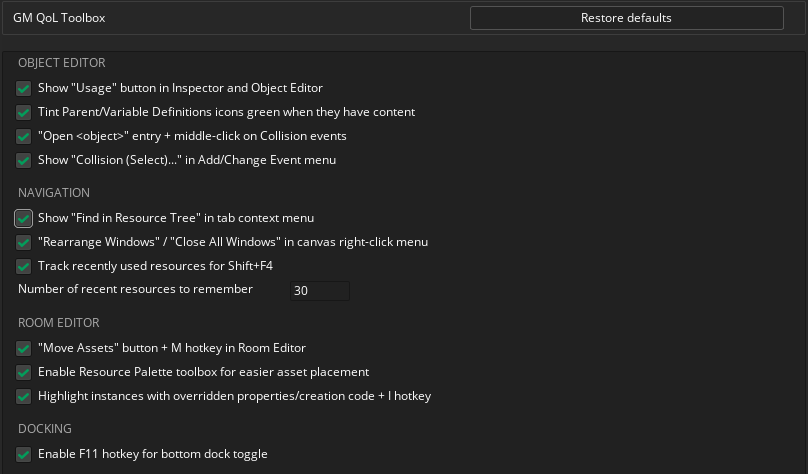

### <a id="advanced-search"></a>`Plugins → Advanced Search`

- A project-wide search built on top of GameMaker's own search engine, with
  exclusion options the native `Search & Replace` doesn't offer:
  - **Case sensitive / Whole word / Ignore comments** — same options as
    the native dialog.
  - **Regex** — search with a regular expression instead of plain text.
    A pattern that takes too long to match (catastrophic backtracking) is
    aborted for that file after a couple of seconds rather than freezing
    the search.
  - **Exclude from search** — checkboxes for whole categories: Objects,
    Scripts, Sequences, Rooms, Notes, Timelines, Shaders.
  - **Exclude group named** — skip every Asset Browser group with a given
    name (comma-separated for more than one), anywhere in the tree,
    including its subgroups — e.g. a vendored "Extensions" or "GMLive"
    folder full of generated code you never want showing up in results.
- A small history dropdown (▾) next to the search field remembers your
  last 10 searches for the current project.
- Every result opens the exact matching line, same as the native dialog.
- Support for tags will be added in the future.

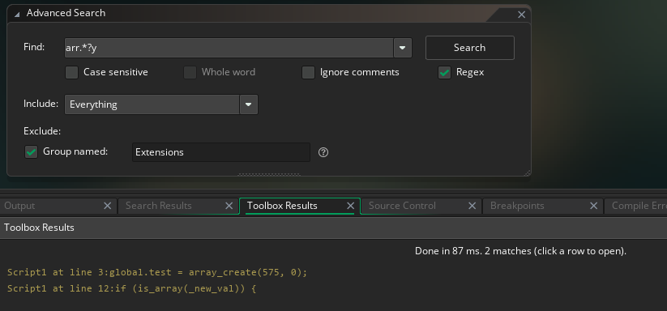

### <a id="toolbar-buttons"></a>IDE main toolbar — quick-access buttons

- Two new buttons in the IDE's main toolbar, next to the native
  collapse/expand-docks button:
  - **Search and Replace** — opens the native `Search & Replace` window,
    same as `Ctrl+Shift+F`.
  - **Advanced Search** — opens this plugin's own [Advanced
    Search](#advanced-search) window.
- Both just save a trip to the menus for searches you run often; neither
  adds behavior beyond what its menu entry already does.

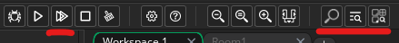

### <a id="check-object-usage"></a>`Plugins → Check Object Usage`

- **Select object...** — the native object picker (the same one used in
  the Object Editor's "Parent" field). Selecting one runs the scan
  immediately.
- Results in four sections:
  - **PARENT OBJECT / CHILD OBJECTS** — the object's inheritance, straight
    from the project model (no scanning involved).
  - **COLLISION EVENTS** — collision events referencing the object, from
    the project model.
  - **ROOM INSTANCES** — every instance of the object in every room,
    grouped by room + layer.
  - **GML CODE / OTHER .yy FILES** — a search of the project's files for
    the object's name (a fallback for references the model doesn't track
    directly).
- Every result row opens the corresponding resource; code hits jump
  straight to the matching line.

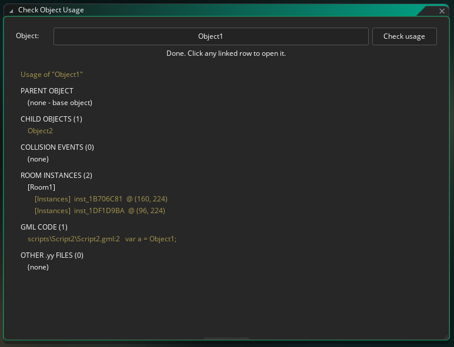

### <a id="object-editor-usage-button"></a>Object Editor — Usage button

- In the compact object edit window (Asset Browser → Edit), a new
  **Usage** button under Variable Definitions opens the full "Check
  Object Usage" report for the object being edited.

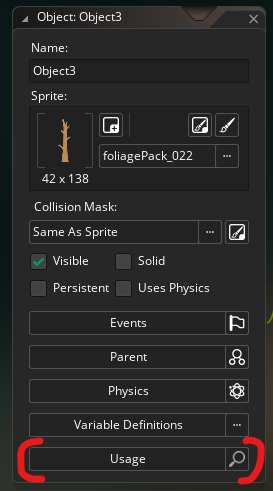

### <a id="inspector-usage-section"></a>Inspector — Usage section (objects)

- The docked Inspector (the properties panel shown when an object is
  selected in the Asset Browser) shows a collapsible **Usage** category,
  mirroring the SpriteUsage plugin's Usage section for sprites.
- Collapsed by default and computes nothing until expanded — only then
  does it show "Searching..." and the real data: parent/child/collision/
  room counts, code references, and a link to the full report.

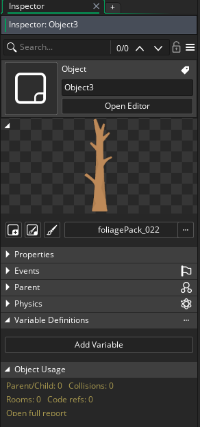

### <a id="object-editor-green-icons"></a>Object Editor — green section icons

- In the compact object edit window (opened from the Asset Browser), the
  icons next to **Parent** and **Variable Definitions** light up green
  when that section actually has content (a parent/children set, even a
  single variable) — visible without expanding the section.

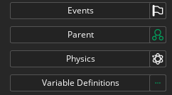

### <a id="object-editor-events-open-collision"></a>Object Editor — "Events" window: opening the collision object

- Right-clicking a **Collision** event in the Events window adds a new
  entry to the existing menu (alongside Add/Cut/Copy/Paste/Duplicate/
  Change/Delete): `Open <object name>`, which opens the editor for the
  object it collides with.
- **Middle mouse button** clicked on such a row does the same thing
  immediately, without opening the menu.
- Also works for Collision events inherited from a parent (greyed-out
  rows).

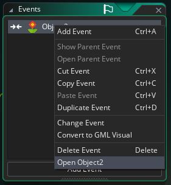

### <a id="object-editor-collision-select"></a>Object Editor — "Add Event"/"Change Event": `Collision (Select)...`

- Next to the built-in `Collision` submenu (which lists every object
  alphabetically, ignoring your Asset Tree folder order, and needs
  clicking through nested folders), a new `Collision (Select)...` entry
  opens the same searchable object picker "Check Object Usage" uses.
- Works identically to the built-in `Collision` for both adding a new
  Collision event (Add Event) and retargeting an existing one (Change
  Event) — same Undo grouping, same GML/Visual prompt.

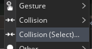
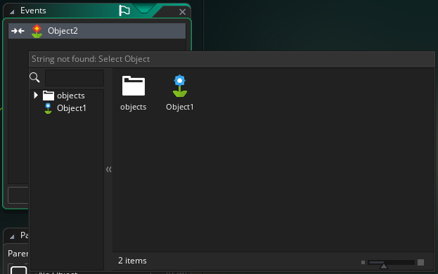

### <a id="check-sprite-usage"></a>`Plugins → Check Sprite Usage`

- **Select sprite...** — the native sprite picker. Selecting one runs the
  scan immediately.
- **Check usage** — re-runs the scan for the currently selected sprite.
- **Find orphans** — scans every sprite in the project and lists the ones
  with no usage at all (no project reference, no GML/.yy hit).
- Results in three sections:
  - **PROJECT RESOURCES** — every typed reference to the sprite from the
    project model (objects using it as sprite or collision mask, rooms,
    tile sets, particle systems, ...), grouped by resource type.
  - **GML CODE** — a search of the project's `*.gml` files for the
    sprite's name.
  - **OTHER .yy FILES** — other resource files mentioning the sprite's
    name, skipping anything already listed under PROJECT RESOURCES.
- Every result row opens the corresponding resource; code hits jump
  straight to the matching line.
- Only added to the `Plugins` menu if the separate SpriteUsage plugin
  isn't already installed — that plugin already provides this exact
  feature, so this one steps aside instead of duplicating it.

### <a id="sprite-editor-usage-button"></a>Sprite Editor — Usage button

- In the Sprite Editor's properties panel (below Nine Slice/Texture
  Settings), a **Usage** button opens the full Check Sprite Usage report
  for the sprite being edited (matches Object Editor's Usage button).

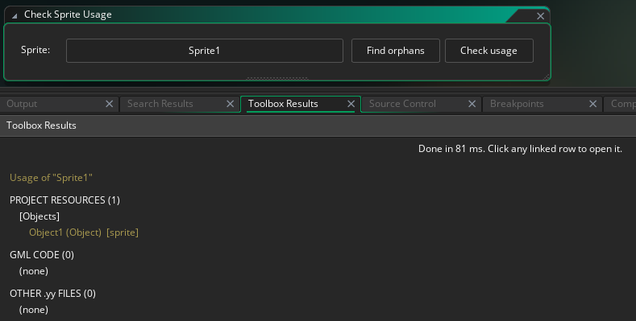

### <a id="inspector-usage-section-sprites"></a>Inspector — Usage section (sprites)

- The docked Inspector shows a collapsible **Sprite Usage** category when
  a sprite is selected, mirroring the Object Editor's Usage section.
- Collapsed by default and computes nothing until expanded — only then
  does it show "Searching..." and the real data: Objects/Rooms/Other
  counts, a Code count (background `*.gml` scan), and a link to the full
  report.
- Toggle in Preferences under **GM QoL Toolbox → Sprite Editor**: "Show
  'Sprite Usage' button in Sprite Editor and Inspector" controls both this
  and the Editor button above; "Disable 'Sprite Usage' section in
  Inspector" hides just this one, independent of the Editor button.

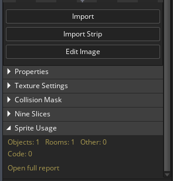

### <a id="image-editor-convert-to-frames-auto"></a>Image Editor — `Convert to Frames`: "Auto" checkbox

- In the native strip-import dialog (Image Editor → `Convert to Frames` /
  `Import from Strip`), a new **Auto** checkbox next to "Number of
  Frames".
- Once checked, Number of Frames and Frames per Row are computed
  automatically from Frame Width/Height and the actual image size (the
  fields become non-editable) — no need to work them out by hand.
- The checkbox state persists for the whole IDE session (not saved to
  disk), so subsequent uses of `Convert to Frames` keep whatever state it
  was last left in.

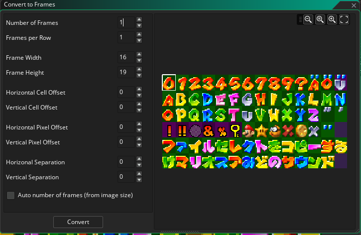
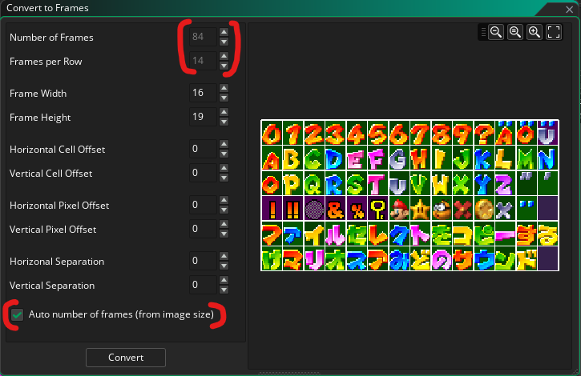

### <a id="f11-bottom-dock"></a>`F11` — collapsing/expanding just the bottom dock

- The native `F12` (`Expand Collapse Docks`) collapses/expands all three
  docks (left, right, bottom) at once. `F11` does the same, but only for
  the bottom dock — where Output, Search Results and similar panels dock
  by default.
- Plain `F11` (no modifier) overlaps with the native debugger shortcut
  `Step Into` — `Shift+F11` (`Step Out`) is not intercepted.
- The bottom dock's collapse bar now shows a "Press F11 to hide" hint on
  the right (in a smaller font than the rest of the UI), so the shortcut
  is discoverable without reading the README.

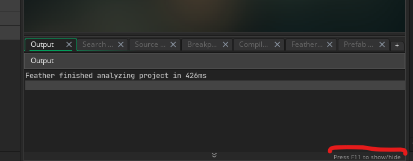

### <a id="find-in-resource-tree"></a>Resource editors — `Find in Resource Tree`

- Right-click on the title bar/tab of any open resource editor → `Find in
  Resource Tree` selects and scrolls to that resource in every open Asset
  Browser (expanding parent folders along the way). If no Asset Browser
  is open, the option does nothing.
- Works for all 15 resource types in the New Asset menu: Object, Sprite,
  Sound, Script, Note, Shader, Animation Curve, Extension, Font, Path,
  Tile Set, Timeline, Particle System, Room, Sequence.

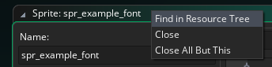

### <a id="rearrange-close-windows"></a>Workspace — `Rearrange Windows` / `Close All Windows`

- Right-click on an empty spot on the workspace canvas → next to the
  `Windows` and `Go To...` submenus, two extra top-level entries:
  - `Rearrange Windows` — lines up every open workspace window into a
    single column, one under another, closing the gaps left by closed
    windows.
  - `Close All Windows` — the same as the native `Close All` at the
    bottom of the `Windows` submenu, just higher up in the menu (with
    many open windows, the original entry is practically unreachable
    without scrolling).

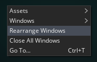

### <a id="shift-f4-recent-resources"></a>`Shift+F4` — Recent Resources

- A list of recently used resources, most-recently-used first — a
  resource moves to the top both when opened and when its editor is
  closed. Limited to 30 entries, cleared when the project closes. Windows
  already open when the plugin starts (GameMaker restores them from the
  previous session) are also added, in roughly top-to-bottom order.
- Clicking a row opens the resource and closes the window; up/down arrows
  move the selection and wrap around, `Enter` opens the selected row,
  `Escape` closes without selecting. The window can also be dragged
  freely.
- Closes automatically on losing focus — like `Go To` (`Ctrl+T`) and
  Workspace Overview (`Ctrl+Tab`), built on the same base class
  (`PopupWindow`).
- Unlike the native `Recent Windows`, it never mixes in events — it's a
  plain list of resources.
- Rows for a resource still open elsewhere are tinted green; the rest stay
  white/default, so you can tell at a glance which ones are already open.

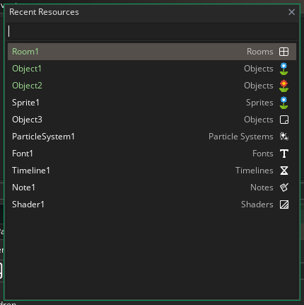

### <a id="room-editor-move-assets"></a>Room Editor — "Move Assets"

- In the room editor's floating toolbar (grid/zoom/show views/playback/
  select-from-any-layer), a new button with a 4-directional arrow icon
  (like `Shift Path` in the Path Editor).
- Opens a small window with **X (px)** and **Y (px)** fields (positive or
  negative values — X has autofocus) and a choice of **This layer** /
  **All layers**.
- On **OK**, if X or Y is non-zero, moves by the given amount:
  - every instance/asset on the selected layer (or on every layer in the
    room, including their sub-layers),
  - tile layers are moved as a whole (layer offset, not individual
    tiles).
- The whole move is a single Undo step (`Ctrl+Z` undoes it all at once).
- A plain (unmodified) press of the `M` key opens this window immediately
  for the currently visible room editor — same as clicking the button.

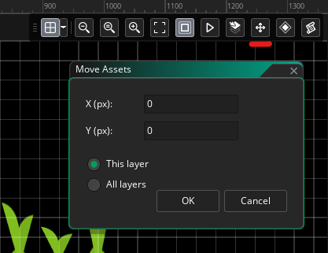

### <a id="room-editor-assets-palette"></a>Room Editor — "Room Assets Palette"

- In the room editor's floating toolbar (next to "Move Assets"), a new
  button with a diamond icon (like Sequence in the Asset Tree). Opens a
  floating window listing Sprites/Objects/Sequences — with folders, just
  like the Asset Tree — that **doesn't close itself** and dynamically
  filters the list to match the currently selected room layer's type
  (Asset layer → Sprite/Sequence, Instance layer → Object; other layer
  types just show a short hint instead of a list).
- Two ways to insert into the room without using the Asset Tree:
  - **Drag and drop** a row onto the room canvas — identical to dragging
    from the Asset Tree (position preview, red X on an incompatible
    layer), plus it automatically selects the inserted instance on drop
    (which the native Asset Tree drag doesn't do).
  - `ALT`+click in the room — uses the palette's selection instead of the
    Asset Tree, as long as the palette was used most recently; clicking
    anything directly in the real Asset Tree (even the same resource
    again) immediately hands priority back to it.
- It have search window. In future versions it would also support tags.
- The window closes automatically together with the project and on IDE
  exit.

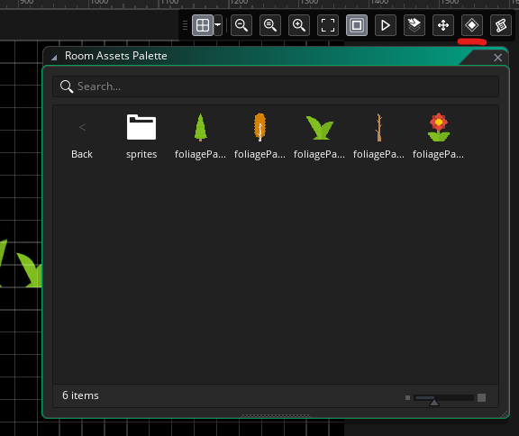

### <a id="room-editor-highlight-overrides"></a>Room Editor — highlighting instances with overrides (`I`)

- Holding `I` (as in "Inheritance") in the room editor highlights every
  instance with a red rectangle (50% opacity) that has:
  - anything overridden under **Variables** — a property of the instance
    itself (editable in the Inspector), not of the object it's based on,
  - and/or its own **Creation Code** set.
- Not `M` — `M` opens `Move Assets` (see above).
- In the toolbar, next to `Select from Any Layer` (and before `Move
  Assets`), there's an icon button (like Script in the Asset Tree, with a
  "(Hold I)" tooltip) — works exactly like `Select from Any Layer`:
  **click** turns the highlight on permanently (until clicked again),
  **holding `I`** turns it on temporarily regardless of the button's
  state. Releasing `I` turns the highlight off, unless the button was
  already turned on manually (by clicking) — in which case it stays on.
- Both `I` and `M` work through a registered Hotkey (the same mechanism
  as the native `Hold P`), so they respect modifiers (`Ctrl+I`,
  `Shift+I` etc. don't trigger them) and show up under `Preferences >
  Keyboard`.

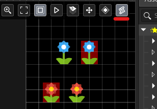

### <a id="room-editor-width-height"></a>Room Editor / Inspector — Width/Height in pixels ("Scale in px")

- For instances and sprite assets in a room: next to the native **Scale
  X**/**Scale Y** fields, a new **Scale in px** row with **W**/**H**
  fields — editable pixel width/height, computed from the sprite's size
  and the current Scale.
- Available in two places, kept in sync with each other and with Scale
  X/Y:
  - the floating properties window (opened by double-clicking an
    instance/sprite asset in the Room Editor) — a new row right under
    Scale X/Scale Y,
  - the docked Inspector's Properties category — one "Scale in px" row
    with W/H fields, right under the native Scale row.
- It's really the same underlying value as Scale X/Y, just in different
  units — editing W/H recomputes and writes Scale X/Y, and editing Scale
  X/Y refreshes W/H back. Arrow-button step: 1 px.
- Only added if the separate SpriteUsage plugin isn't already installed —
  that plugin already provides this, so this one steps aside instead of
  duplicating it.

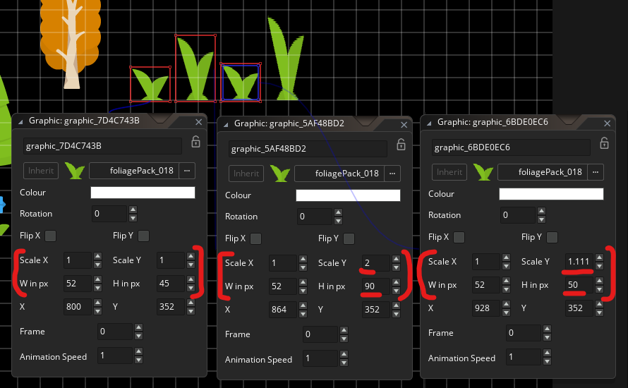
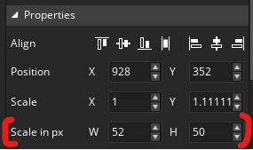

### <a id="font-editor-copy-range"></a>Font Editor — `Copy Range as Text`

- In the Font Editor, below `Regenerate`, a new **Copy Range as Text**
  button.
- Builds one continuous string out of every character in every defined
  range (`lower` to `upper` inclusive, no gaps between ranges and no
  truncation — unlike the character preview next to each range, which
  cuts off after a few hundred characters for long ranges) and copies it
  to the system clipboard.
- Useful when designing a pixel font in an external tool (e.g. Photoshop)
  that needs to match the font's actual character set — previously the
  only way to get that list out was retyping it by hand from the range
  list, where each range sits on its own line.
- The button briefly shows "Copied!" after a click.

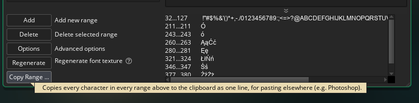
Results in `!"#$%&'()*+,-./0123456789:;<=>?@ABCDEFGHIJKLMNOPQRSTUVWXYZ[\]^_``abcdefghijklmnopqrstuvwxyz{|}~ÓóĄąĆćĘꣳŃńŚśŹźŻż▯`

## Known limitations

- The GML/.yy scan reads files from disk — if you have unsaved changes in
  an editor, results may differ slightly from what's on screen. Also, it means scanning disk a lot.
- References built dynamically from strings (e.g.
  `asset_get_index("obj_" + x)`) are not detected.
- Not tested with Code Editor 2

## Bug Reports

Found a bug, or something behaving unexpectedly? Please open an issue on
this repo:

**[github.com/gmclan-org/gm-qol-toolbox-plugin/issues](https://github.com/gmclan-org/gm-qol-toolbox-plugin/issues)**

Do not report bugs about this plugin to YoYo Games — see the disclaimer
below for why. If you encounter an issue in the IDE itself, please
disable or uninstall this plugin first, try to reproduce the issue
without it, and only report it to YYG if it still occurs.

## Disclaimer

GM QoL Toolbox is developed independently and is not affiliated with
YoYo Games. GameMaker's plugin system is unofficial and undocumented,
and YoYo Games has been clear that plugin compatibility isn't a factor
in their release planning — any IDE update can break this plugin without
warning, and keeping it working is entirely on this project, not on YYG.

## License

MIT — see [LICENSE](LICENSE).
